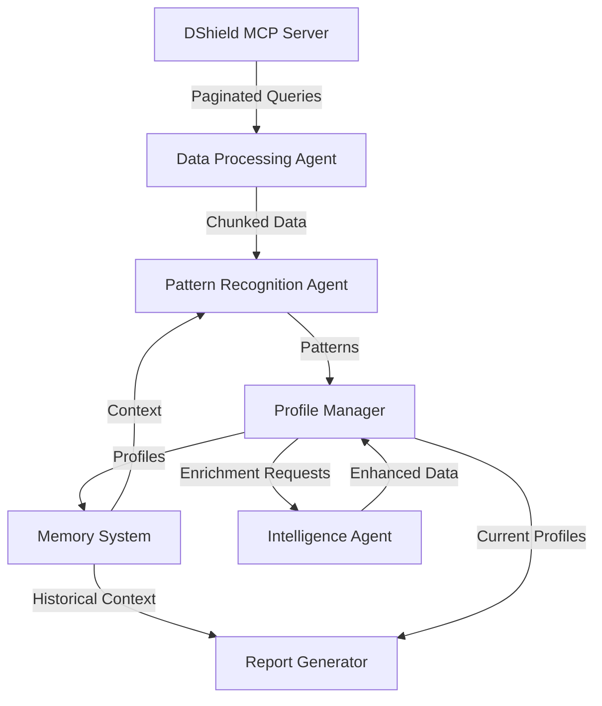

# Long-Tail Analysis Agent System
## Product Requirements Document v1.0

### Executive Summary
A locally-deployed intelligent analysis system for DShield honeypot data that performs long-tail security analysis, builds comprehensive attacker profiles, and manages large-scale temporal datasets through efficient context management and memory systems.

### Problem Statement
Current analysis of DShield honeypot data faces critical limitations:
- Context window constraints prevent analysis of large temporal datasets (10k+ records/day over month+ periods)
- Existing MCP server capabilities (pagination, streaming, session grouping) are underutilized by agents
- No persistent memory for tracking analysis progress and building attacker profiles
- Lack of automated correlation between attack patterns and threat intelligence
- Manual effort required for long-tail pattern detection across extended time periods

### Solution Overview
A multi-agent system that:
1. Efficiently chunks and processes large datasets using existing MCP capabilities
2. Maintains persistent memory of attacker profiles and patterns
3. Performs incremental analysis with context preservation
4. Enriches profiles through web research
5. Generates comprehensive threat intelligence reports

## System Architecture

### Core Components

#### 1. Analysis Orchestrator
**Purpose**: Manages the overall analysis workflow and coordinates between agents

**Key Features**:
- Intelligent time window segmentation (4-6 hour chunks with 1-hour overlaps)
- State management for long-running analyses
- Progress tracking and resumption capabilities
- Resource allocation and scheduling

**Technical Requirements**:
- Python 3.11+ with asyncio support
- Integration with dshield-mcp server
- Support for both local LLMs and API-based models

#### 2. Data Processing Agent
**Purpose**: Efficiently retrieves and preprocesses data from the MCP server

**Key Features**:
- Utilizes MCP pagination (`cursor`, `page_size` parameters)
- Implements streaming with session context (`stream_dshield_events_with_session_context`)
- Smart query optimization using MCP's `optimization` parameter
- Pre-aggregation and statistical summarization
- Anomaly detection for focused analysis

**MCP Integration Points**:
- `query_dshield_events` with proper pagination
- `stream_dshield_events_with_session_context` for session grouping
- `get_data_dictionary` for field understanding

#### 3. Profile Manager
**Purpose**: Maintains and evolves attacker profiles over time

**Data Structure**:
```json
{
  "entity_id": "ip_192.168.1.1",
  "entity_type": "ip|asn|composite",
  "profile": {
    "first_seen": "timestamp",
    "last_seen": "timestamp",
    "activity_windows": [],
    "attack_patterns": {
      "scanning": {},
      "exploitation": {},
      "persistence": {}
    },
    "behavioral_fingerprint": "embedding_vector",
    "confidence_scores": {},
    "ttps": [],
    "infrastructure": {
      "asn": "",
      "geo": "",
      "related_ips": []
    }
  },
  "analysis_metadata": {
    "last_analysis": "timestamp",
    "analysis_depth": "shallow|deep|comprehensive",
    "data_quality": "score"
  }
}
```

**Storage Requirements**:
- Vector database for similarity search (ChromaDB/Qdrant)
- SQLite for structured profile data
- Redis for active analysis cache

#### 4. Pattern Recognition Agent
**Purpose**: Identifies long-tail patterns and anomalies

**Key Features**:
- Temporal pattern analysis (daily, weekly, monthly cycles)
- Clustering of similar attack behaviors
- Statistical outlier detection
- TTP (Tactics, Techniques, Procedures) classification

**Analysis Methods**:
- Sliding window correlation
- Sequence pattern mining
- Behavioral clustering
- Anomaly scoring algorithms

#### 5. Intelligence Enrichment Agent
**Purpose**: Enriches profiles with external threat intelligence

**Key Features**:
- Web research for IP/ASN reputation
- OSINT correlation
- Threat actor attribution
- Infrastructure mapping

**API Integrations**:
- Claude API for complex analysis
- OpenAI API for embeddings
- Web search APIs for OSINT

#### 6. Memory System
**Purpose**: Provides persistent memory across analysis sessions

**Components**:
- **Working Memory**: Active analysis context (Redis)
  - Current analysis state
  - Recent patterns
  - Active profiles being updated
  
- **Long-term Memory**: Historical patterns and profiles (Vector DB + SQLite)
  - Attacker profiles
  - Pattern library
  - Analysis history
  
- **Semantic Memory**: Embedded representations (ChromaDB)
  - Pattern embeddings
  - Profile summaries
  - Similar attack clusters

### Data Flow



## Functional Requirements

### FR1: Data Ingestion
- **FR1.1**: System shall query DShield data using time-based windows
- **FR1.2**: System shall handle pagination for results exceeding 1000 records
- **FR1.3**: System shall utilize streaming for real-time analysis
- **FR1.4**: System shall respect API rate limits and query timeouts

### FR2: Analysis Capabilities
- **FR2.1**: System shall identify attack patterns across multiple time scales
- **FR2.2**: System shall cluster similar behaviors into attack campaigns
- **FR2.3**: System shall detect anomalies using statistical methods
- **FR2.4**: System shall maintain analysis state for resumption

### FR3: Profile Management
- **FR3.1**: System shall create unique profiles for IPs, ASNs, and combinations
- **FR3.2**: System shall update profiles incrementally with new data
- **FR3.3**: System shall merge related profiles when connections are discovered
- **FR3.4**: System shall calculate confidence scores for profile attributes

### FR4: Memory Functions
- **FR4.1**: System shall persist analysis state between sessions
- **FR4.2**: System shall retrieve relevant historical context for new analyses
- **FR4.3**: System shall implement TTL-based cache eviction
- **FR4.4**: System shall provide similarity search for patterns

### FR5: Intelligence Enrichment
- **FR5.1**: System shall perform web research on identified entities
- **FR5.2**: System shall correlate findings with threat intelligence sources
- **FR5.3**: System shall cache enrichment data to avoid redundant lookups
- **FR5.4**: System shall handle API failures gracefully

### FR6: Reporting
- **FR6.1**: System shall generate comprehensive threat reports
- **FR6.2**: System shall provide profile summaries on demand
- **FR6.3**: System shall export data in multiple formats (JSON, Markdown, CSV)
- **FR6.4**: System shall include confidence scores and data quality metrics

## Non-Functional Requirements

### Performance
- **NFR1**: Process 10,000 records within 5 minutes
- **NFR2**: Maintain memory usage under 32GB RAM
- **NFR3**: Support analysis windows up to 90 days
- **NFR4**: Handle concurrent analysis of 10+ profiles

### Scalability
- **NFR5**: Support dataset growth to 1M+ records/month
- **NFR6**: Scale profile database to 100k+ entities
- **NFR7**: Adapt to new attack patterns without code changes

### Reliability
- **NFR8**: Resume analysis after system restart
- **NFR9**: Handle MCP server timeouts gracefully
- **NFR10**: Maintain data consistency during failures

### Usability
- **NFR11**: Provide progress indicators for long-running analyses
- **NFR12**: Offer interactive profile exploration
- **NFR13**: Support natural language queries for data retrieval

## Technical Specifications

### Development Environment
- **Language**: Python 3.11+
- **OS**: macOS (M4 Max optimization)
- **Memory**: 64GB RAM (32GB allocated to system)

### Core Dependencies
- **MCP Integration**: dshield-mcp server
- **Vector Database**: ChromaDB or Qdrant
- **SQL Database**: SQLite
- **Cache**: Redis or in-memory
- **LLM Frameworks**: 
  - Ollama (local)
  - Anthropic SDK
  - OpenAI SDK

### LLM Configuration
- **Local Model**: Mixtral 8x7B or Llama 3.1 70B (quantized)
- **Claude API**: Complex analysis and reasoning
- **OpenAI API**: Embeddings and classification

### Data Storage
- **Profiles**: SQLite + Vector embeddings
- **Analysis State**: JSON in SQLite
- **Cache**: Redis with 24-hour TTL
- **Logs**: Structured JSON logs with rotation

## Implementation Phases

### Phase 1: Foundation (Week 1-2)
- Set up project structure
- Implement MCP client wrapper with proper pagination
- Create basic profile data model
- Implement SQLite storage layer
- Build simple CLI interface

### Phase 2: Core Analysis (Week 3-4)
- Implement time window chunking
- Build pattern recognition algorithms
- Create profile CRUD operations
- Add working memory cache
- Integrate local LLM for analysis

### Phase 3: Memory System (Week 5-6)
- Set up vector database
- Implement embedding generation
- Build similarity search
- Create memory retrieval system
- Add profile evolution tracking

### Phase 4: Intelligence Enrichment (Week 7-8)
- Integrate Claude/OpenAI APIs
- Build web research agent
- Implement enrichment caching
- Add threat intelligence correlation
- Create profile merging logic

### Phase 5: Optimization & Reporting (Week 9-10)
- Optimize query performance
- Build report generation
- Add export capabilities
- Implement monitoring
- Performance tuning

## Success Metrics

### Quantitative
- **Analysis Speed**: < 1 minute per 1000 records
- **Memory Efficiency**: < 50% of available RAM
- **Profile Accuracy**: > 85% precision in attack classification
- **Pattern Detection**: Identify 90% of known attack patterns
- **System Uptime**: > 99% availability

### Qualitative
- Meaningful long-tail patterns discovered
- Actionable threat intelligence generated
- Reduced manual analysis effort
- Improved threat attribution accuracy

## Risk Mitigation

### Technical Risks
- **Context Window Limits**: Mitigated by chunking and summarization
- **Memory Overflow**: Mitigated by TTL and importance-based eviction
- **API Rate Limits**: Mitigated by caching and request queuing
- **Data Quality**: Mitigated by confidence scoring and validation

### Operational Risks
- **Long Analysis Times**: Mitigated by incremental processing
- **System Failures**: Mitigated by state persistence
- **Resource Constraints**: Mitigated by adaptive processing

## Appendix A: MCP Server Capabilities

### Available Query Parameters
- `time_range_hours`: Time window for analysis
- `page_size`: Results per page (max 1000)
- `cursor`: Pagination cursor
- `optimization`: Query optimization mode
- `fields`: Specific fields to return
- `sort_by` / `sort_order`: Result ordering
- `include_summary`: Statistical summaries

### Streaming Parameters
- `chunk_size`: Events per chunk (max 1000)
- `max_session_gap_minutes`: Session grouping threshold
- `session_fields`: Fields for session correlation

## Appendix B: Profile Schema Evolution

### Version 1.0 (Current)
- Basic IP/ASN profiles
- Simple attack pattern tracking
- Manual enrichment

### Version 2.0 (Planned)
- Composite entity profiles
- Behavioral embeddings
- Automated enrichment
- Confidence scoring

### Version 3.0 (Future)
- Graph-based relationships
- Predictive capabilities
- Real-time streaming analysis